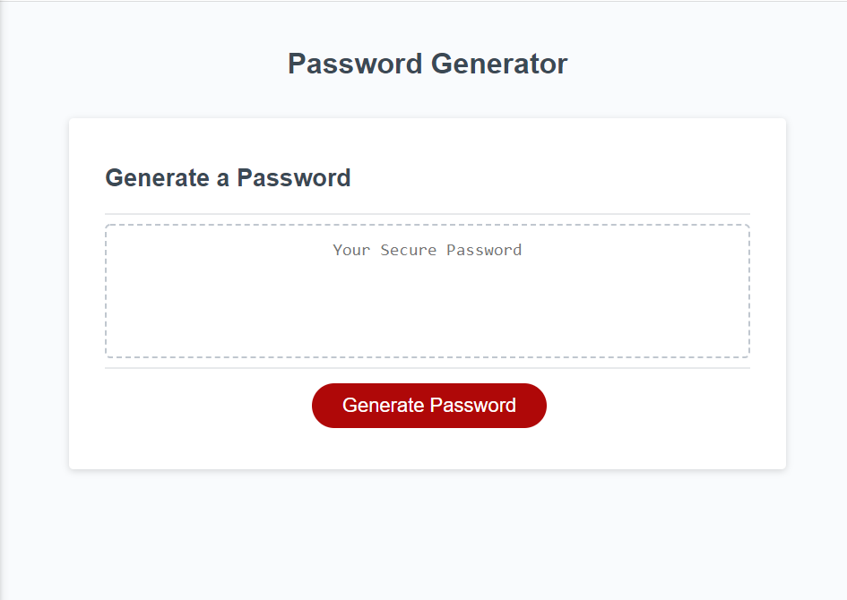

# Random Password Generator

## Description

A simple website that can generate a random password based on user criteria.  The user can select how long they want the password to be and which types of characters they would like to be included. Randomly generated passwords can add a lot of security to accounts.

## Languages Used

- HTML
- CSS
- javascript

## Installation

No istallation is necessary. Just visit the deployed site and generate your new random password.

## Usage

[github repository](https://github.com/josephkurpierz/random-password-generator)
[deployed web page](https://josephkurpierz.github.io/random-password-generator/)

To use this random password generator, simply click on the "Generate Password" button and follow the onscreen prompts.  Once all prompts and confirms are answered while meeting the criteria of password length and containing at least one character type, your password will display in the box.

## Credits

 Trilogy Education Services, LLC, a 2U, Inc. brand - for providing all HTML and CSS.

 ## License

 [MIT license](./LICENSE.txt)